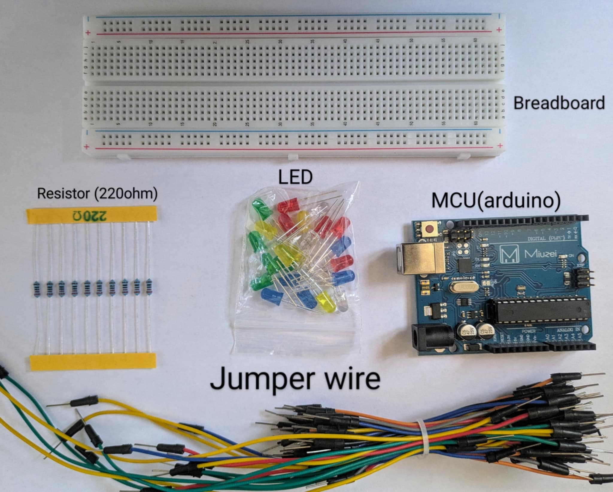
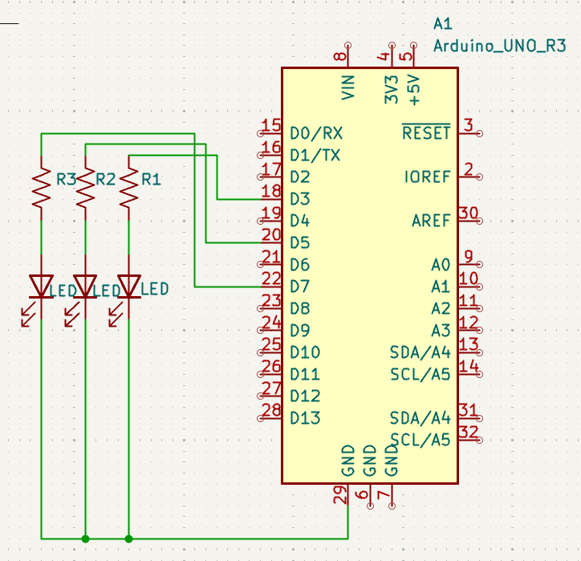
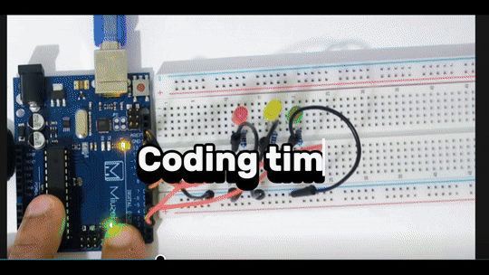

# LED-Traffic-Light  1
## Simulation of Real-World Logic – “Timing, Sequence, Control”

The **third step** in my embedded systems grind. We’re not playing games here—this is **real-world behavior** coded into a microcontroller. A full **traffic light sequence**, down to the second. Simple to watch. Powerful to understand.

---

## 🧭 Why This Matters

Embedded systems run the real world. This project simulates how logic becomes physical. Timers, loops, delays—this is the groundwork. It’s not just about turning LEDs on and off. It’s about replicating **systems thinking** in code.

### ⚙️ What I Learned This Time

- Sequential state logic is the backbone of control systems  
- Timing + repetition = real-life mimicry  
- `for()` loops handle repetition like a pro  
- Hardware obeys, but code has to lead with confidence  

---

## 🔩 Parts I Used



---

## 📈 Schematics



---

## 🛠️ Wiring It Up


---

## 👨‍💻 The Code Behind the Simulation



```cpp
int redled = 3;
int yellowled = 5;
int greenled = 7;

void setup() {
  pinMode(redled, OUTPUT);
  pinMode(yellowled, OUTPUT);
  pinMode(greenled, OUTPUT);
}

void loop() {
  digitalWrite(greenled, HIGH);    // Green on
  delay(5000);                      // 5 seconds
  digitalWrite(greenled, LOW);     // Green off

  for (int i = 0; i < 3; i++) {     // Yellow flashes 3 times
    delay(500);
    digitalWrite(yellowled, HIGH);
    delay(500);
    digitalWrite(yellowled, LOW);
  }

  delay(500);
  digitalWrite(redled, HIGH);      // Red on
  delay(5000);                     // 5 seconds
  digitalWrite(redled, LOW);       // Red off
}
```

## 🧠 The Concept
This is more than blinking lights—this is system simulation. We’re modeling a traffic flow control system: green to yellow to red. This is how industrial engineers design and prototype logic before committing to hardware at scale.

## 🎬 Final Result

### Each light turns on with a purpose. A rhythm. A cycle. And then it repeats—forever. Just like traffic in the real world. This isn’t art. This is control logic in action.


🎥 Watch the Full Build Video:
👉 [https://youtu.be/f2dNCj9sKas]

## 💬 Final Thoughts
Want to become an embedded engineer? Stop thinking like a coder. Start thinking like a system. This project taught me control, timing, and structure. LEDs are just the medium—the message is discipline.
